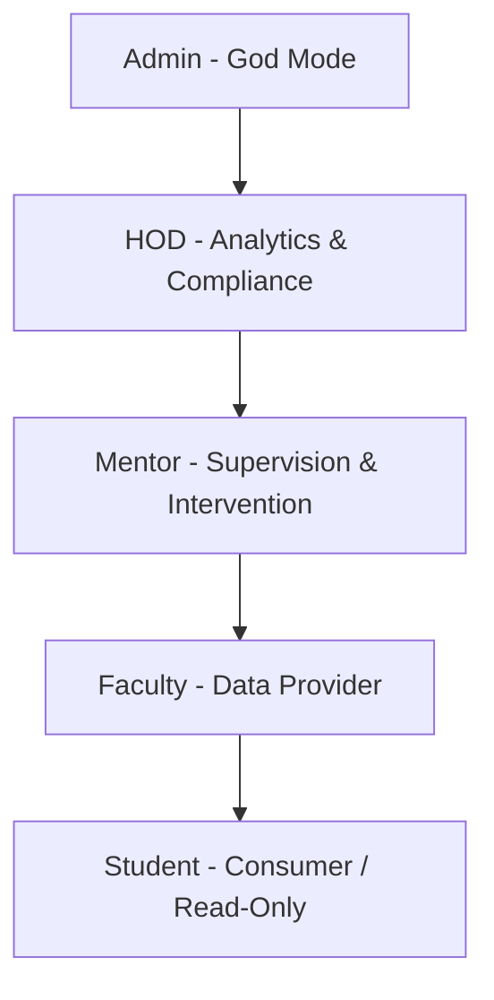
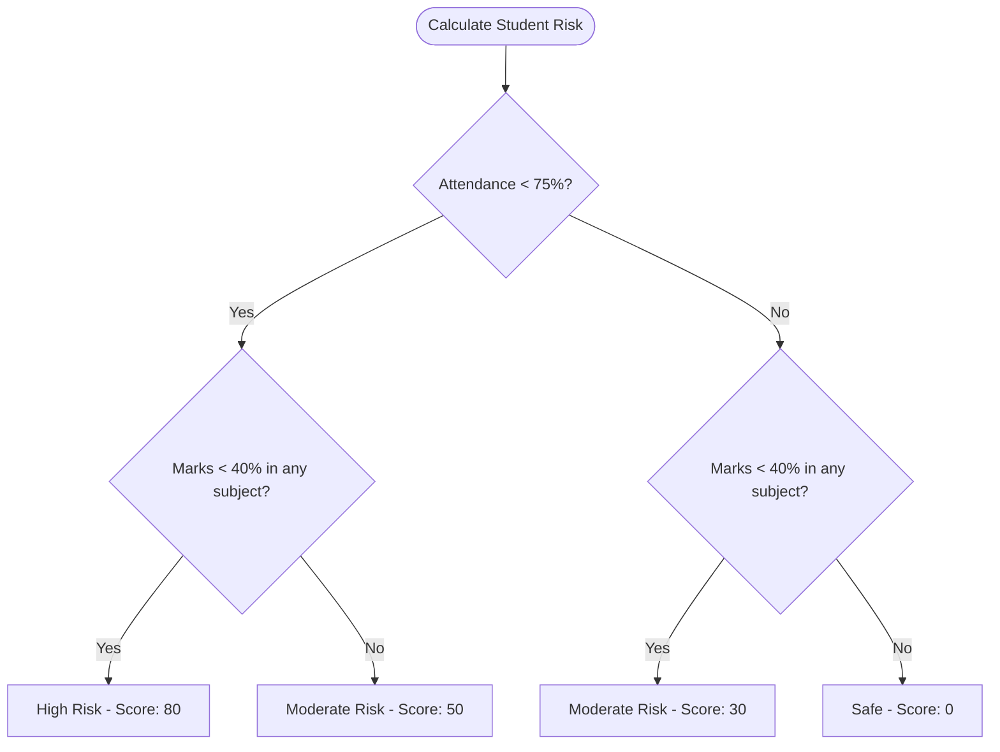

# Product Requirement Document (PRD)
## KSV Smart Academic Monitoring System

---

**Version History**

- 1.0.0 — Initial production-ready specification — 2026-07-09
- 2.0.0 — Enhanced production-ready specification with advanced features — 2026-07-09
- 3.0.0 — Integrated comprehensive feature acceptance criteria, success metrics, and test strategy — 2026-07-09

---

**Table of Contents**

1. Document Control & Overview
2. Product Goal & Objectives
3. Technology Stack & Architecture
4. Role-Based Access Control (RBAC)
5. Data Models & Schema Design
6. Core Features & Business Workflows
7. API Routes Reference
8. System Cron Jobs
9. Non-Functional & Quality Requirements
10. Appendix

---

### 1. Document Control & Overview

*   **Document Version:** 2.0.0
*   **Target Institution:** Kadi Sarva Vishwavidyalaya (KSV), Gujarat
*   **System Name:** KSV Smart Academic Monitoring System
*   **Status:** Enhanced Production-Ready Specification

This document defines the product requirements, system architecture, database models, role-based access controls, and functional specifications of the KSV Smart Academic Monitoring System, generated directly from the revisioned structure of the codebase.

---

### 2. Product Goal & Objectives

The KSV Smart Academic Monitoring System is designed to solve the challenges of tracking, predicting, and intervening in student academic performance and retention. By integrating real-time lecture attendance and internal marks evaluations, the system automatically detects students at risk of detention or failure, prompts mentor interventions, logs student medical leaves and achievements, and keeps parents informed.

#### Core Objectives:
*   **Early Risk Mitigation:** Calculate risk scores dynamically based on attendance and internal grades with predictive analytics.
*   **Proactive Interventions:** Facilitate structured logging of counseling, parent communication, and remedial coaching by Mentors.
*   **Data Integrity & Streamlined Ingestion:** Allow bulk uploads of student lists, attendance sheets, and grades via CSV files with robust header normalization.
*   **Data Transparency:** Provide role-based dashboards tailored to Students, Faculty, Mentors, HODs, and Admins.
*   **Advanced Analytics:** Implement predictive modeling, trend analysis, and comprehensive reporting with PDF/Excel export.
*   **Enhanced Security:** Add audit trails, session management, and Redis-based caching for improved performance and security.
*   **Communication:** Enable in-app messaging system for real-time communication between users.
*   **Timetable Management:** Provide comprehensive timetable management for departments and divisions.
*   **Assignment Tracking:** Implement assignment and project submission tracking with evaluation capabilities.
*   **Automated Backups:** Ensure data safety with automated daily backups and restore capabilities.

---

### 3. Technology Stack & Architecture

The application is built on a modern MERN stack architecture with automatic fallbacks for local database dependencies:

*   **Frontend:** React.js (v18) built with standard Bootstrap (v5), Custom CSS, Chart.js for data visualization, and React Router Dom (v6) for navigation.
*   **Backend:** Node.js + Express.js API server configured with CORS support, JSON web tokens (JWT) for secure session handling, and file-upload processing via Multer.
*   **Database:** MongoDB using the Mongoose ODM.
    *   *Production/Development:* Local or remote MongoDB server.
    *   *Automatic Fallback:* In the absence of a running local MongoDB instance on port 27017, the backend automatically provisions a `mongodb-memory-server` in memory, seeds mock database records, and continues server execution.
*   **Caching Layer:** Redis (via `ioredis`) for session management, API response caching, and real-time data caching.
*   **Email Engine:** Brevo API (via `sib-api-v3-sdk`) for automated monthly parent reports and manual notification emails.
*   **Scheduler:** `node-cron` for executing automated end-of-month academic reports and daily backups.
*   **Reporting:** PDFKit for PDF generation and ExcelJS for Excel report generation.
*   **API Documentation:** Express OpenAPI Validator for request validation and API documentation.

---

### 4. Role-Based Access Control (RBAC)

The system supports 5 distinct user roles. Access levels are strictly managed via Express middleware (`protect` and `admin/role` validators):

| User Role | Access Tier | Primary Functions |
| :--- | :--- | :--- |
| **Student** | Read-Only / Consumer | View dashboard (Risk level, attendance metrics, grade lists), log extra-curricular achievements, submit medical leave applications, run What-if simulator. |
| **Faculty** | Operational / Data Provider | Manage master student directory, upload daily lecture attendance, upload internal marks (both manual & bulk CSV), track class status logs. |
| **Mentor** | Supervisory / Interventionist | View assigned mentees, log counseling notes and nudges, review/approve medical leaves and student achievements, email parents and students. |
| **HOD** | Tactical / Analyst | View department-wide statistics, audit compliance reports, view failure analysis, review projected detention forecasts, track faculty impact metrics. |
| **Admin** | Strategic / System Controller | Perform User CRUD (Faculty/Mentor/HOD/Admin setup), configure department/subject models, manage academic calendar, reset semesters, download audit logs. |

---

### 5. Data Models & Schema Design

The system relies on 15 interrelated Mongoose schemas:

#### 5.1 User (User.js)
Stores credential and authentication details:
*   `email` (String, Unique, Required)
*   `passwordHash` (String, Required) - Encrypted using `bcryptjs`
*   `role` (String, Enum: `student`, `faculty`, `mentor`, `hod`, `admin`)
*   `isActive` (Boolean, Default: `true`)
*   *Timestamps enabled*

#### 5.2 Student (Student.js)
Extends the user account for student-specific data points:
*   `userId` (ObjectId referencing `User`, Required)
*   `enrollmentNumber` (String, Unique, Required)
*   `firstName` (String, Required)
*   `lastName` (String, Required)
*   `department` (String, Required)
*   `currentSemester` (Number, Required)
*   `division` (String, Required)
*   `mentorId` (ObjectId referencing `User`)
*   `parentEmail` (String, Optional)
*   `profilePicture` (String, Path, Optional)
*   `riskProfile` (Object):
    *   `score` (Number, Default: `0`)
    *   `level` (String, Enum: `Safe`, `Moderate Risk`, `High Risk`, Default: `Safe`)
    *   `reasons` (Array of Strings)

#### 5.3 Faculty (Faculty.js)
Extends the user account for faculty-specific details:
*   `userId` (ObjectId referencing `User`, Required)
*   `firstName` (String, Required)
*   `lastName` (String, Required)
*   `employeeId` (String, Unique, Required)
*   `department` (String, Required)
*   `designation` (String, Required)
*   `isMentor` (Boolean, Default: `false`)

#### 5.4 LectureAttendance (LectureAttendance.js)
Tracks lecture-by-lecture attendance:
*   `subjectName` (String, Required)
*   `facultyId` (ObjectId referencing `User`, Required)
*   `date` (Date, Required)
*   `records` (Array of objects):
    *   `studentId` (ObjectId referencing `Student`, Required)
    *   `status` (String, Enum: `P`, `A`, Default: `P`)

#### 5.5 InternalMarks (InternalMarks.js)
Registers student performance in internal mid-semester or sessionals:
*   `studentId` (ObjectId referencing `Student`, Required)
*   `subjectName` (String, Required)
*   `semester` (Number, Required)
*   `examType` (String, Required - e.g., 'Mid-Sem')
*   `maxMarks` (Number, Required)
*   `marksObtained` (Number, Required)

#### 5.6 Intervention (Intervention.js)
Tracks counseling activities, warnings, and nudges:
*   `studentId` (ObjectId referencing `Student`, Required)
*   `mentorId` (ObjectId referencing `User`, Required)
*   `type` (String, Enum: `Meeting`, `Call`, `Email`, `Other`, `Nudge`, Required)
*   `date` (Date, Default: `Date.now`)
*   `status` (String, Enum: `Open`, `Closed`, `In Progress`, Default: `Open`)
*   `remarks` (String, Required)
*   `actionPlan` (String, Optional)
*   `isRead` (Boolean, Default: `false`)

#### 5.7 MedicalLeave (MedicalLeave.js)
Maintains leave history used for attendance corrections:
*   `studentId` (ObjectId referencing `Student`, Required)
*   `startDate` (Date, Required)
*   `endDate` (Date, Required)
*   `reason` (String, Required)
*   `certificateUrl` (String, Required) - Path to uploaded certificate
*   `status` (String, Enum: `pending`, `approved`, `rejected`, Default: `pending`)
*   `mentorRemarks` (String, Optional)
*   `approvedBy` (ObjectId referencing `User`, Optional)

#### 5.8 Achievement (Achievement.js)
Extra-curricular achievements submitted by students for review:
*   `studentId` (ObjectId referencing `Student`, Required)
*   `title` (String, Required)
*   `description` (String, Required)
*   `date` (Date, Required)
*   `certificateUrl` (String, Required)
*   `status` (String, Enum: `pending`, `approved`, `rejected`, Default: `pending`)
*   `verifiedBy` (ObjectId referencing `User`)
*   `remarks` (String, Optional)

#### 5.9 ClassUpdate (ClassUpdate.js)
Faculty log of classes conducted or cancelled (used for HOD audit logs):
*   `facultyId` (ObjectId referencing `User`, Required)
*   `subject` (String, Required)
*   `date` (Date, Required)
*   `topic` (String, Required)
*   `status` (String, Enum: `conducted`, `cancelled`, Default: `conducted`)
*   `remarks` (String, Optional)

#### 5.10 SystemConfig (SystemConfig.js)
Allows dynamic configuration of system thresholds (e.g., minimum attendance rate):
*   `key` (String, Required, Unique)
*   `value` (String, Required)
*   `description` (String, Optional)
*   `updatedBy` (ObjectId referencing `User`)

#### 5.11 Other Schemas
*   `Department.js`: Maps institutional departments (name, code).
*   `Subject.js`: Catalogues courses (name, code, department, semester, credits, type).
*   `AcademicCalendar.js`: Events schedule (title, startDate, endDate, type).
*   `EmailLog.js`: Audits outgoing emails (senderId, recipientEmail, subject, status, type, error).
*   `Notification.js`: Real-time notifications for users (recipientId, title, message, type, priority, isRead).
*   `AuditLog.js`: Comprehensive audit trail for all system actions (userId, action, entityType, description, ipAddress, metadata).
*   `Session.js`: User session management (userId, token, ipAddress, deviceInfo, expiresAt, isActive).
*   `Message.js`: In-app messaging system (senderId, recipientId, content, messageType, isRead, threadId).
*   `Timetable.js`: Department timetable management (department, semester, division, schedule, effectiveFrom, effectiveTo).
*   `Assignment.js`: Assignment and project tracking (title, description, subject, dueDate, maxMarks, submissions).

---

### 6. Core Features & Business Workflows

#### 6.1 Authentication & Profile Management
*   **Workflow:** Multi-role logins are handled through a single credentials interface. System issues secure JWT tokens. 
*   **Student Profile Customization:** Students can upload profile images processed via Multer (`POST /api/student/profile-picture`) and update fields such as semester and names.
*   **Acceptance Criteria:**
    *   Passwords must be hashed using `bcryptjs` with at least 10 salt rounds.
    *   Protected API routes return 401 Unauthorized or 403 Forbidden on token failures or invalid roles.
    *   Users are locked out temporarily after 5 consecutive failed login attempts.
*   **Success Metrics:** JWT verification latency < 10ms; login failure audit log coverage = 100%.

#### 6.2 Data Ingestion (Bulk CSV & Manual)
*   **Student Uploads (studentManagementController.js):**
    *   Faculty/Admin uploads a spreadsheet of students.
    *   Parser normalizes columns (e.g., matching `enrollment_no` or `enrollment` to internal keys).
    *   Automatically provisions linked `User` accounts with default credentials (`123456`) if missing.
*   **Attendance & Marks CSV Uploads (facultyController.js):**
    *   File stream matches enrollment columns, parses attendance statuses (`P`/`A`) or numeric marks, matches references in O(N), and saves records.
*   **Acceptance Criteria:**
    *   Fuzzy matching automatically maps header aliases (e.g. `Enrollment No` -> `enrollmentNumber`).
    *   Failed rows generate an inline download of `errors.csv` indicating exact row numbers and validation faults.
    *   Database ingestion uses atomic transactions where possible to prevent partial loads.
*   **Success Metrics:** Ingestion processing time < 2 seconds per 1,000 rows; ingestion error rate < 2% for non-technical uploads.

#### 6.3 Student Risk Profile Calculation Engine
*   **Logic Rule:**
    $$\text{Overall Attendance} = \frac{\text{Present Lectures}}{\text{Total Registered Lectures}} \times 100$$
    *   An internal marks check flags low performance if the student scores $< 40\%$ in any assessment.
    *   **High Risk:** If overall attendance is $<75\%$ AND low marks flag is active. (Score = 80)
    *   **Moderate Risk:** If overall attendance is $<75\%$ OR low marks flag is active. (Score = 50 or 30)
    *   **Safe:** If attendance $\ge 75\%$ and marks $\ge 40\%$. (Score = 0)
*   **Acceptance Criteria:**
    *   Risk logic is unified under `backend/utils/riskCalculator.js` and covered by unit tests.
    *   Dynamic updates recalculate risk profiles immediately on attendance/marks change.
*   **Success Metrics:** Accuracy of High Risk labels vs actual end-of-semester detention/failure rates >= 90%.

#### 6.4 Mentorship & Counseling Loop
*   **Nudges:** Faculty/Mentors can create quick alerts directly showing up on the student's dashboard feed (`POST /api/faculty/notify`).
*   **Intervention Logs:** Mentors log formal meeting records, calls, or remedial measures, updating progress status (`Open`, `In Progress`, `Closed`).
*   **Acceptance Criteria:**
    *   Closed interventions are read-only and audited.
    *   Mentees must be notified within 5 seconds via WebSockets or in-app alerts when a mentor nudges them.
*   **Success Metrics:** Intervention resolution rate (Moderate/High Risk students returning to Safe status) >= 60%.

#### 6.5 Medical Leave Approval Workflow
*   **Application:** Students upload medical certificates and specify dates (`POST /api/leaves`).
*   **Resolution:** Mentors inspect applications, write comments, and click Approve or Reject, allowing attendance adjustments.
*   **Acceptance Criteria:**
    *   Approved medical leaves automatically recalculate and correct affected lecture attendance.
    *   Uploading certificate only accepts PDF/PNG/JPG files < 5MB.
*   **Success Metrics:** Document verification upload failure rate = 0%; average processing turnaround < 48 hours.

#### 6.6 HOD Compliance & Advanced Analytics
*   **Detention Forecast:** Scans all attendance entries to project end-of-term statuses (flagging students who cannot mathematically recover even with 100% attendance).
*   **Assessment Difficulty Analyzer:** Computes the pass-rate of each exam. If pass rate is $<50\%$, flags the exam as *Too Hard*; if $>95\%$, flags it as *Grade Inflation*.
*   **Intervention Effectiveness:** Displays the percentage of formerly high-risk students who recovered back to safe/moderate thresholds following logged mentor interactions.
*   **Acceptance Criteria:**
    *   HOD dashboard updates are cached using Redis with a TTL of 1 hour.
    *   Detention forecast mathematically projects student maximum possible attendance.
*   **Success Metrics:** Average load time of Department Analytics page < 300ms under normal load.

#### 6.7 Admin Controls
*   **Academic Calendar Setup:** Adds visual events directly displaying in the student planner.
*   **Reset Semester:** Facilitates end-of-year operations by promoting all students to the next semester.
*   **Reporting & Log Download:** Generates system audit logs (CSV downloads mapping email logs and class changes) to ensure transparency.
*   **Backup Management:** Manual and automated database backups with restore capabilities.
*   **Acceptance Criteria:**
    *   Backup creation zip-compresses DB snapshots and cleans files older than 7 days.
    *   Audit logs track the IP, user ID, timestamp, and target entity for all writes.
*   **Success Metrics:** Zero data loss during automated nightly backups; system recovery time (RTO) < 10 minutes.

#### 6.8 Advanced Analytics & Predictive Modeling
*   **Predictive Analytics:** Machine learning-based prediction of student performance trends using historical data.
*   **Trend Analysis:** Attendance and marks trend analysis with trajectory assessment.
*   **Department Analytics:** Comprehensive department-wide analytics including semester-wise and subject-wise performance metrics.
*   **Risk Trajectory:** Assessment of student risk trajectory (improving, stable, worsening) with confidence levels.
*   **Top Performers:** Identification of top-performing students for recognition and awards.
*   **At-Risk Students:** Advanced filtering and analysis of at-risk students with intervention recommendations.

#### 6.9 Enhanced Security & Audit
*   **Audit Logging:** Comprehensive audit trail for all system actions including user activities, data modifications, and system events.
*   **Session Management:** Advanced session management with device tracking, location logging, and session revocation capabilities.
*   **Security Monitoring:** Real-time security monitoring with anomaly detection and alerting.
*   **Access Control:** Granular access control with role-based permissions and data-level security.

#### 6.10 Communication System
*   **In-App Messaging:** Real-time messaging system between users (student-faculty, student-mentor, faculty-admin, etc.).
*   **Message Threading:** Threaded conversations with reply functionality and context preservation.
*   **Message Categories:** Categorized messages (academic, administrative, personal, intervention, general).
*   **Priority Levels:** Message priority levels (low, normal, high, urgent) for urgent communications.
*   **Read Receipts:** Message read status tracking and read receipts.

#### 6.11 Timetable Management
*   **Department Timetables:** Comprehensive timetable management for departments, semesters, and divisions.
*   **Weekly Schedule:** Day-wise and period-wise schedule management with faculty and room assignments.
*   **Effective Periods:** Timetable versioning with effective from/to dates for academic year management.
*   **Room Management:** Room allocation and conflict resolution for lecture scheduling.
*   **Faculty Availability:** Faculty availability tracking and workload distribution.

#### 6.12 Assignment & Project Tracking
*   **Assignment Creation:** Faculty can create assignments with descriptions, due dates, and submission requirements.
*   **Submission Tracking:** Student submission tracking with late submission detection and status management.
*   **Evaluation System:** Marks allocation and feedback system for assignment evaluation.
*   **Submission Analytics:** Comprehensive submission analytics including submission rates and performance metrics.
*   **File Attachments:** Support for assignment attachments and student submission files.

---

### 7. API Routes Reference

#### Authentication
*   `POST /api/auth/login` - Public user login
*   `GET /api/auth/profile` - Get logged-in user details

#### Students
*   `GET /api/student/dashboard` - Get student metrics, attendance, marks, and risk status
*   `POST /api/student/simulate` - What-if simulation for SPI and risk
*   `POST /api/student/profile-picture` - Upload avatar image (Multer)
*   `GET /api/student/notifications` - Retrieve incoming notifications/nudges

#### Faculty Operations
*   `GET /api/faculty/analytics` - Get low engagement lists and class health metrics
*   `POST /api/faculty/notify` - Dispatch nudge to student
*   `POST /api/faculty/attendance` - Manual attendance registry
*   `POST /api/faculty/attendance-csv` - Upload attendance via CSV
*   `POST /api/faculty/marks` - Upload evaluation marks manually
*   `POST /api/faculty/marks-csv` - Upload evaluation marks via CSV

#### Mentors
*   `GET /api/mentor/mentees` - View assigned mentees list
*   `POST /api/mentor/intervention` - Create counseling record
*   `GET /api/mentor/analytics` - View mentorship workload and program success metrics

#### Head of Department (HOD)
*   `GET /api/hod/analytics` - Retrieve department summary
*   `GET /api/hod/deep-analytics` - Retrieve failure metrics, audit streams, and detention lists

#### Administrative Controls
*   `POST /api/admin/users` - Register custom accounts
*   `POST /api/admin/faculty` - Register faculty profiles
*   `POST /api/admin/assign-mentor` - Maps student IDs to mentors
*   `POST /api/admin/system/reset-semester` - Promote students in bulk
*   `GET /api/admin/system/logs` - Export CSV activity audit log

#### Advanced Analytics
*   `GET /api/analytics/student/:id/predict` - Get predictive analytics for student
*   `GET /api/analytics/department/:name` - Get department analytics
*   `POST /api/analytics/report` - Generate comprehensive analytics report (PDF/Excel)
*   `GET /api/analytics/top-performers/:department` - Get top performers
*   `GET /api/analytics/at-risk/:department` - Get at-risk students

#### Backup Management
*   `POST /api/admin/backup/create` - Create manual backup
*   `POST /api/admin/backup/restore` - Restore from backup
*   `GET /api/admin/backup/list` - List available backups
*   `DELETE /api/admin/backup/:filename` - Delete backup
*   `GET /api/admin/backup/stats` - Get backup statistics

---

### 8. System Cron Jobs

#### Monthly Report Job
*   **Trigger Interval:** `0 0 1 * *` (First day of every month at midnight).
*   **Job Tasks:**
    1.  Calculates monthly attendance percentage for all active students.
    2.  Calculates internal grades average percentage.
    3.  Evaluates and updates the database Student Risk Profile object.
    4.  Triggers Brevo API to send formal HTML emails to parents showing academic updates and risk levels.
    5.  Logs outgoing emails inside `EmailLog` collections.

#### Automated Backup Job
*   **Trigger Interval:** `0 2 * * *` (Daily at 2 AM).
*   **Job Tasks:**
    1.  Creates compressed backup of entire MongoDB database.
    2.  Stores backup with timestamp in `/backups` directory.
    3.  Logs backup status and size.
    4.  Cleans up backups older than 7 days (configurable).

#### Backup Cleanup Job
*   **Trigger Interval:** `0 3 * * 0` (Weekly on Sunday at 3 AM).
*   **Job Tasks:**
    1.  Scans backup directory for old backups.
    2.  Deletes backups older than 30 days (configurable).
    3.  Logs cleanup statistics.

---

### 9. Non-Functional & Quality Requirements

*   **Security:** Passwords are fully hashed with salt rounds on the database. Route authorization checks matching JWT tokens and role validations. Enhanced with audit logging, session management, and Redis-based caching.
*   **Reliability:** Auto-fallback to memory server ensures the service is testable locally even when physical database instances are missing. Automated daily backups ensure data safety and disaster recovery.
*   **Performance:** Redis caching layer for improved API response times and reduced database load. Optimized database queries with proper indexing.
*   **Scalability:** Horizontal scaling support with session storage in Redis. Load balancer compatibility with stateless API design.
*   **Ingestion Safety:** Temporary uploaded files (CSVs and medical certificates) are cleaned up from local disk storage once read.
*   **Auditability:** Comprehensive audit trail for all system actions with user tracking, IP logging, and metadata capture.
*   **Reporting:** Advanced reporting capabilities with PDF and Excel export for analytics and compliance reporting.
*   **Monitoring:** Real-time monitoring with Winston logging, performance metrics, and health check endpoints.
*   **API Documentation:** OpenAPI specification with request validation for improved API usability and testing.
